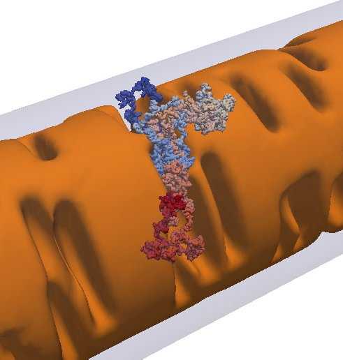
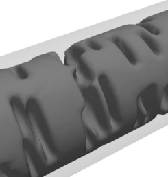

# Random Walk Simulation in the Intermembrane Space

The code uses the files IM.vtk and OM.vtk as inner and outer membrane surfaces, respectively. Both files should be previously generated by the codes in the folder **xmlgenerator**.

This code can be compiled by using **CMake** and it requires VTK.

This is a simple example of how a random walk can be simulated considering complex geometries like mitochondrial cristae. We start with the particle in the intermembrane space and then we update the particle position by a random displacement.

We use the method `IsInsideSurface` from the class `vtkSelectEnclosedPoints` to check whether the particle has not gonne inside the IM. To check whether the particle has gonne outside the OM, we calculate the radial distance form the particle to the center, once the OM is represented by a cylinder.

### Known bugs:

The particle can get trapped in the cristae junction and the algorithm enters an infinite loop. This still have to be fixed.
